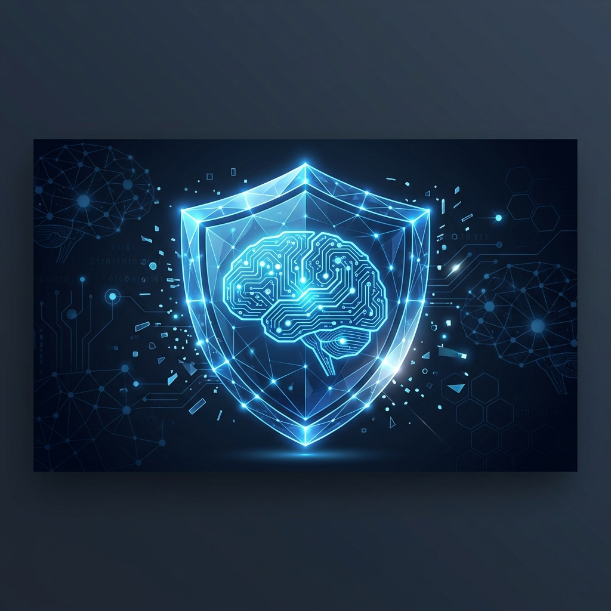
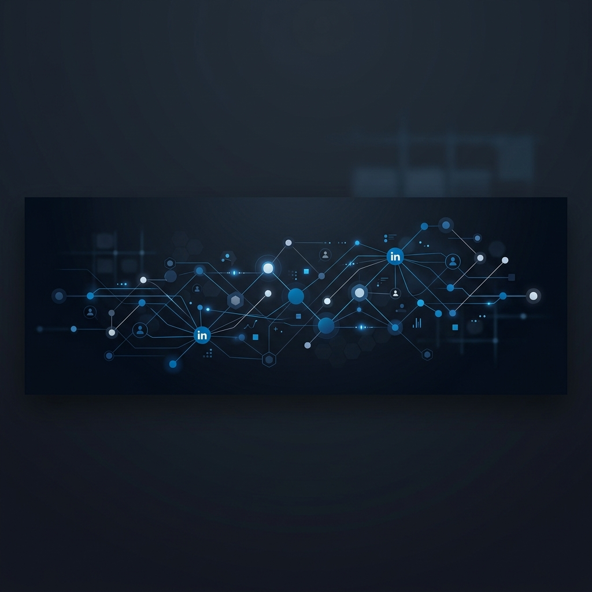
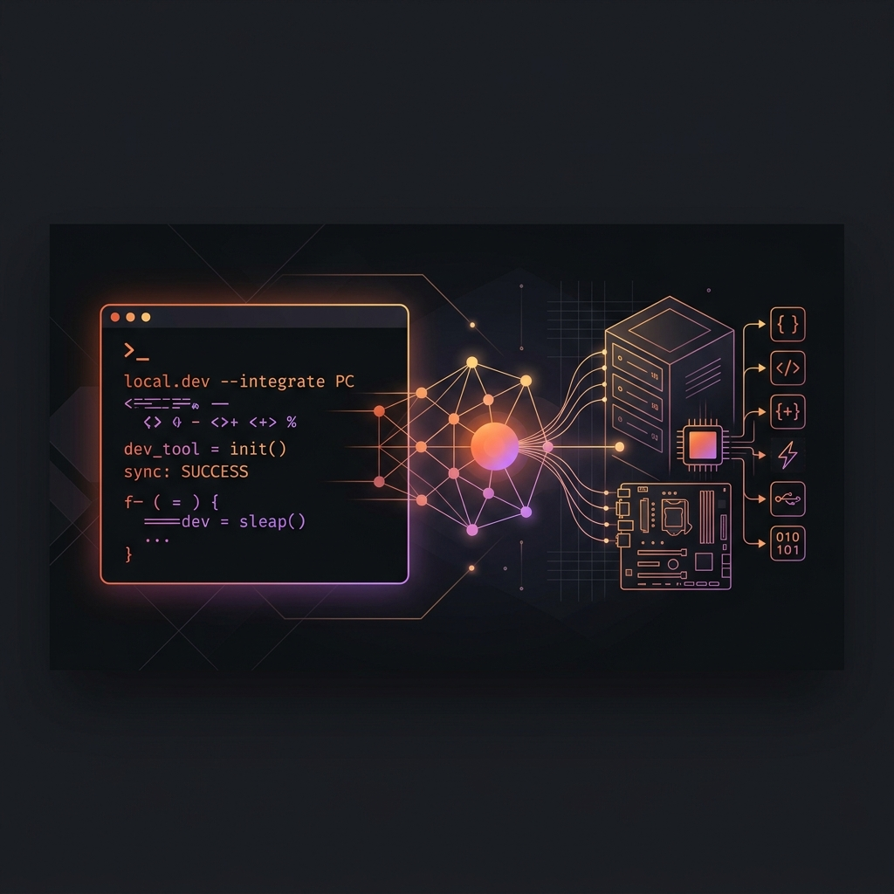
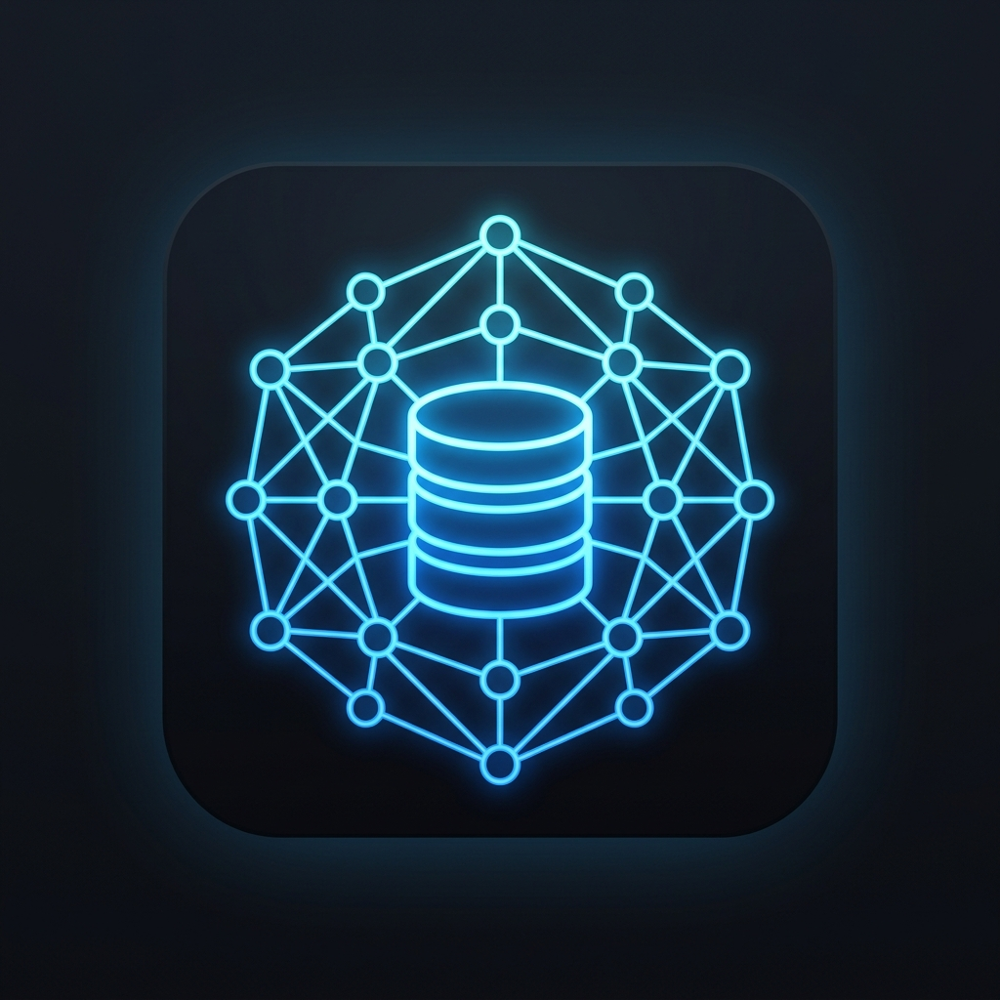
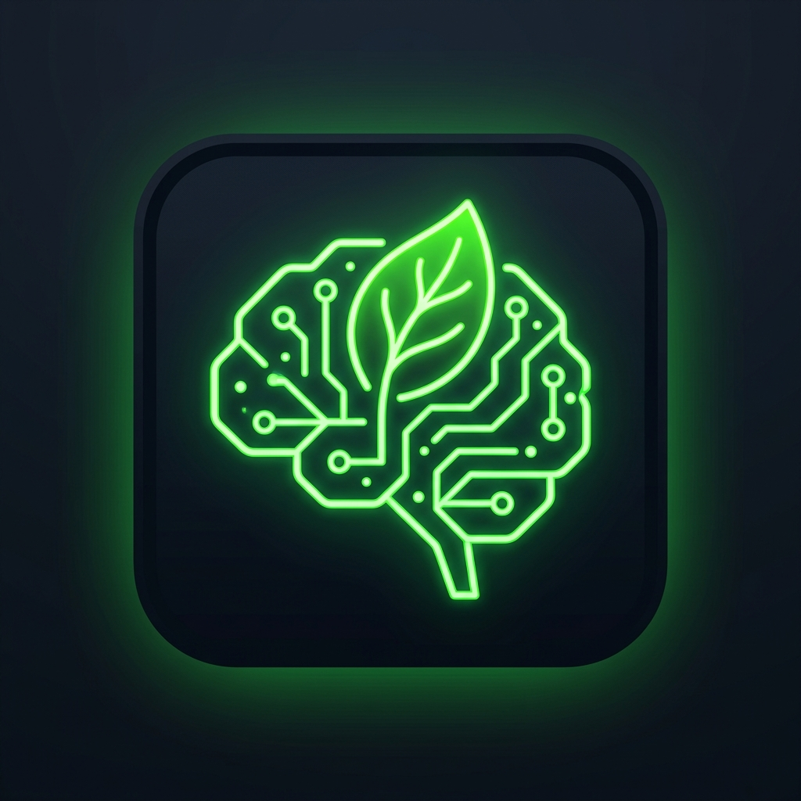

  

  # Hi there, I'm Ahmed Eldasoky 👋

  **Applied AI Engineer | Backend Architecture & Agentic AI (MCP)** 
  *FastAPI, Node.js, PostgreSQL*

   

  
  

---

## 🧑‍💻 About Me

I build backend systems where data stops being raw and starts being actionable. As **Backend Lead and AI Architect on CompliAI** — a B2B SaaS platform automating EU AI Act compliance — I design the full-stack infrastructure connecting React frontends, PostgreSQL schemas, and GPT-4o inference pipelines.

I'm also an **AI Intern at FlyRank**, working on the automation layer behind organic and AI-search visibility — and I build agentic infrastructure on the side: custom MCP (Model Context Protocol) servers that give Claude direct, on-demand control over real systems — a local machine, a LinkedIn account, a browser session.

E-JUST's rigorous CS curriculum gave me the foundations: embedded systems, operating systems, database internals, algorithms. What I did next was take those first principles into production — leading a 7-engineer cross-functional team on CompliAI, shipping EcoLensAI (**3rd place, Green Entrepreneurship Competition**) with a 4-person team, and owning the consequences of every architectural decision along the way.

---

## 💼 Experience

### **AI Architect / Backend Lead** | *CompliAI*   `Mar 2024 – Present`
- Designed and built full-stack B2B SaaS infrastructure for EU AI Act compliance automation.
- Architected React + PostgreSQL + GPT-4o inference pipeline connecting frontend to AI backend.
- Led a cross-functional team of 7 engineers across frontend, backend, and AI/ML, managing sprint planning and code reviews.
- Developed agentic AI systems for automated compliance document processing.

### **AI Intern** | *FlyRank*   `Jul 2026 – Aug 2026`
- Working on the automation layer for organic and AI-search visibility during an intensive 8-week internship program.
- Developing pipelines to enhance product visibility and performance using advanced AI capabilities.

### **Backend Developer** | *AI-Powered CRM Pipeline*   `Jan 2025 – Jul 2025`
- Built an automated web-scraping microservice utilizing Node.js and Puppeteer to navigate pages and extract raw metadata at scale.
- Integrated GPT-4o to dynamically parse unstructured scraped data into highly structured JSON formats.
- Architected a scalable, multi-tenant Supabase and PostgreSQL schema secured via Row Level Security (RLS).
- Delivered a robust Express.js REST API equipped with strict error handling, protected routing, and comprehensive Jest test coverage.

---

## 🛠️ Technical Skills

### Languages & Core

### Backend & APIs

### AI, ML & Automation

### Dev, Infra & Frontend

---

## 🚀 Featured Projects

<table width="100%">
  <tr>
    <td width="33%" align="center">
       
      <h3>CompliAI (EU AI Act)</h3>
      
Automated risk classification for AI systems under the EU AI Act using a React + PostgreSQL + GPT-4o inference pipeline.

      
<b>TypeScript · FastAPI · PyTorch</b>

      
    </td>
    <td width="33%" align="center">
       
      <h3>LinkedIn Automation MCP Server</h3>
      
Built a 19-tool MCP server for LinkedIn profile management. Engineered smart connection prioritization & session persistence.

      
<b>TypeScript · Playwright · MCP SDK</b>

      
    </td>
    <td width="33%" align="center">
       
      <h3>Local PC Control MCP Server</h3>
      
Developed a 12-tool MCP server granting AI assistants direct local machine access: file I/O, shell execution, permission safety.

      
<b>TypeScript · Node.js · MCP SDK</b>

      
    </td>
  </tr>
</table>

<table width="100%">
  <tr>
    <td width="50%" align="center">
       
      <h3>AI-Powered CRM Pipeline</h3>
      
Automated web-scraping microservice with <b>GPT-4o</b> integration for intelligent lead enrichment. Extracts raw web data via Puppeteer.

      
<b>Node.js · Puppeteer · OpenAI API · Supabase</b>

      
    </td>
    <td width="50%" align="center">
       
      <h3>RC5 AVR Microcontroller Simulator</h3>
      
Browser-based AVR simulator featuring a code editor, real-time I/O tracking, and RC5 encryption natively in AVR Assembly via a custom JS interpreter.

      
<b>HTML · CSS · JS · AVR Assembly</b>

    </td>
  </tr>
</table>

---

## 🎓 Education & Certifications

- **B.Sc. Computer Science** | *Egypt-Japan University of Science & Technology (E-JUST)*
- **8th Baheya Breast Cancer Conference (Oct 2025)** - Awarded 25.75 AACME CME Credits

---

## 📊 GitHub Stats

 

  
  

 

  <i>🚀 Always building. Always learning.</i>

